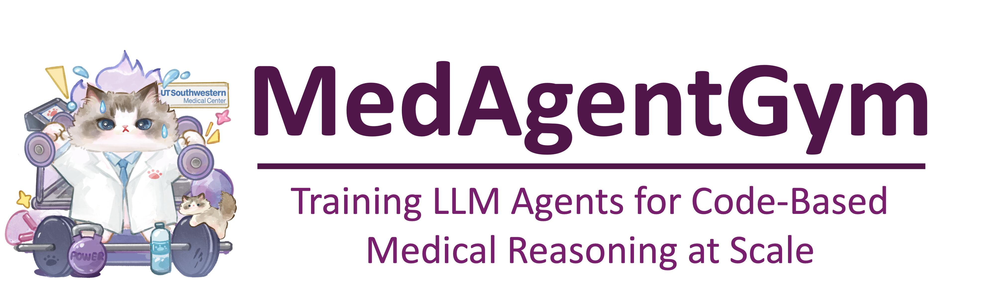
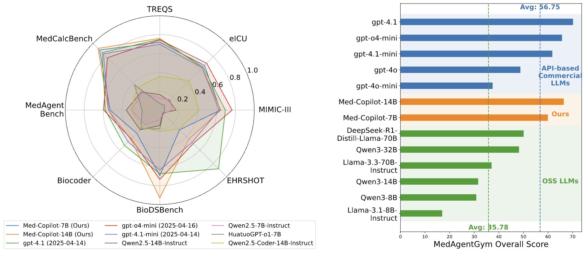
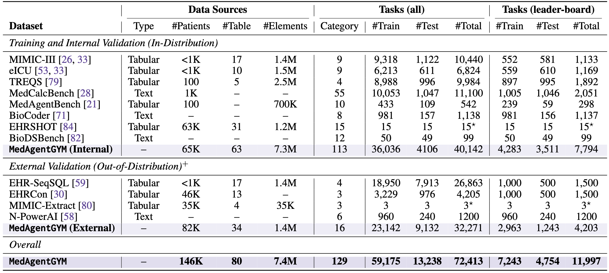
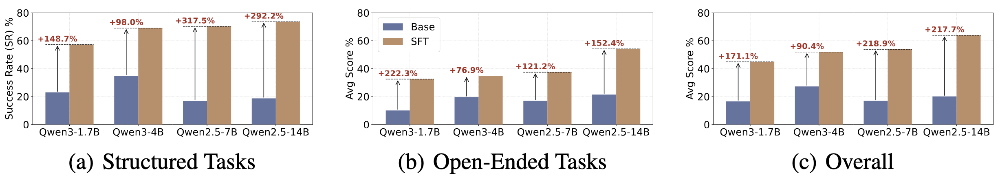
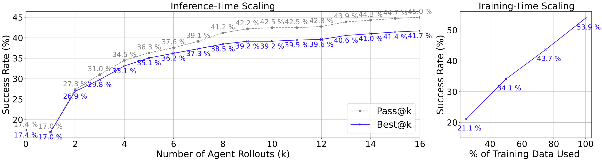

<p align="center">
  
</p>

----
<p align="center">
<a href="https://arxiv.org/pdf/2506.04405">📃 Paper</a>
•
<a href="https://wshi83.github.io/MedAgentGym-Page/">📜 Document</a>
•
<a href="https://huggingface.co/MedAgentGym" >🤗 Data & Models</a>
</p>

## MedAgentGYM
This is the official repository for the paper: "MedAgentGym: Training LLM Agents for Code-Based Medical Reasoning at Scale". In the paper, we introduce MedAgentGYM, the first publicly available training environment designed to enhance coding-based medical reasoning capabilities in large language model (LLM) agents. 

<p align="center">
  
</p>

### Dataset Access

#### EHR Data Access (<font color=#FF000>Important!!!</font>)
MedAgentGym has been carefully curated with strict adherence to ethical standards, leveraging datasets that are publicly available or that incorporate rigorous privacy protection and anonymization measures. Table 7 in the Appendix provides detailed access requirements for each of the 12 datasets included in MedAgentGym. Researchers seeking access to preprocessed task and data files should first obtain and attach all required data usage agreements and submit a formal request via email to `medagentgym@gmail.com`, using the subject line “MedAgentGym Preprocessed Data Access".

#### Tasks Definition and Access
We provide the basic data of `train_tasks.jsonl` and `test_tasks.jsonl` in this repository, which contains.
Once the previous step is taken and the access is approved, we will send the applicants a `download_data.py` file to down load the entire pre-processed dataset from HuggingFace. This will automatically download the full datasets we have prepared and uploaded in a private repository of an anonymous HuggingFace Account. Please download the data into the directory `./data/`. The downloaded dataset should be like `./data/biocoder/*`. The dataset details involved in the paper are listed below:

<p align="center">
  
</p>


### Build Docker Container
As our dataset is based on the docker environment for isolated coding and execution. Thus, you need to build the docker container first. Please run the following command:
```bash
docker buildx build -t ehr_gym:latest .
```
or directly run the command we have prepared:
```bash
bash build_docker.sh
```

### Run Experiment
Please prepare the experiment scripts in the `entrypoint.sh` file. For example if we wnat to run the experiments on biocoder task and test the performance of gpt-4.1-mini. We can run the following command for 5-thread parallel running:
```bash
python3 /home/main.py --config /home/configs/gpt_4_1_mini/exp-gpt_4_1_mini-biocoder.yaml --async_run --parallel_backend joblib --n_jobs 5
```

## Results

### Sampled Data Helps Agent Training

Figure below highlights substantial performance gains from SFT across four OSS backbone LLMs of varying sizes.
<p align="center">
  
</p>

### Warmed-up DPO Works Best for Coding Agent Training
The table below compares several post-training methods, revealing that simple SFT over successful trajectories significantly boosts performance on structured coding tasks, demonstrating its effectiveness in capturing structured coding patterns. Besides, DPO is particularly beneficial for optimizing open-ended task performance. Although DPO alone slightly underperforms compared to SFT, combining an initial SFT warm-up with subsequent DPO further improves overall results by leveraging their complementary strengths.

<p align="center">
  
</p>

### MedAgentGym Enables Both Inference- and Training-Time Scaling

<p align="center">
  
</p>


**Inference-Time Scaling:** The left figure illustrates performance scaling with increased trajectory sampling. Pass@K significantly improves from 17.0% at K = 1 to 45.0% at 16, while Best@K shows steady advancement from 17.0% to 41.7%. The relatively small gap between metrics indicates that our trained verifier effectively identifies successful trajectories, unleashing its potential as a reward model for integration into advanced online RL frameworks such as Proximal Policy Optimization (PPO) and Group Relative Policy Optimization (GRPO).

**Training-Time Scaling:** The right figure examines agent performance as a function of increased training data volumes (25%, 50%, 75%, and 100%) in SFT. We observe consistent performance improvements with greater training data availability, suggesting additional computational resources dedicated to sampling further trajectories are likely to yield continued performance gains.

## 📚 Citation

```bibtex
@misc{xu2025medagentgymtrainingllmagents,
      title={MedAgentGym: Training LLM Agents for Code-Based Medical Reasoning at Scale}, 
      author={Ran Xu and Yuchen Zhuang and Yishan Zhong and Yue Yu and Xiangru Tang and Hang Wu and May D. Wang and Peifeng Ruan and Donghan Yang and Tao Wang and Guanghua Xiao and Carl Yang and Yang Xie and Wenqi Shi},
      year={2025},
      eprint={2506.04405},
      archivePrefix={arXiv},
      primaryClass={cs.CL},
      url={https://arxiv.org/abs/2506.04405}, 
}
```