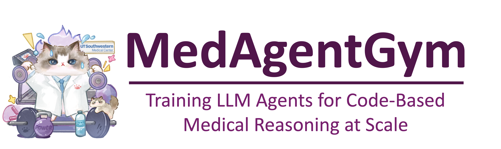
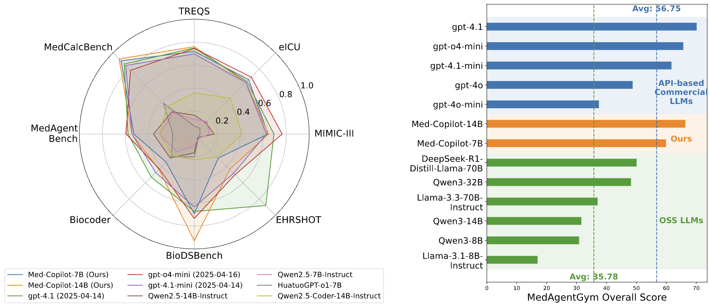
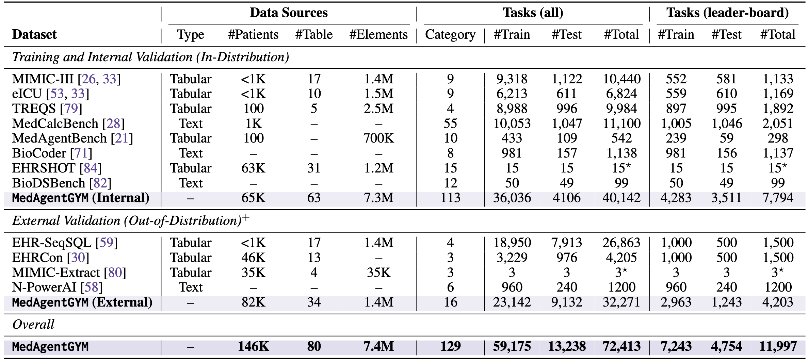
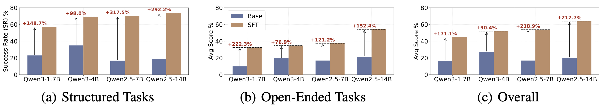
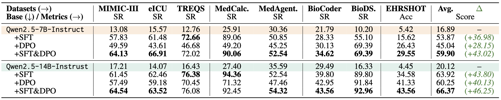
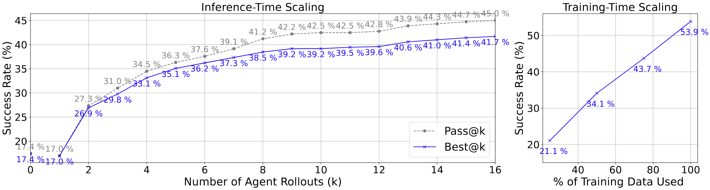

<p align="center">
  
</p>

----
<p align="center">
  <a href="https://www.arxiv.org/abs/2506.04405" target="_blank"></a>
  <a href="https://wshi83.github.io/MedAgentGym-Page"></a>
  <a href="https://huggingface.co/MedAgentGym"></a>
  <a href="mailto:medagentgym@gmail.com"></a>
</p>


## MedAgentGYM
This is the official repository for the paper: "MedAgentGym: Training LLM Agents for Code-Based Medical Reasoning at Scale". In the paper, we introduce MedAgentGYM, the first publicly available training environment designed to enhance coding-based medical reasoning capabilities in large language model (LLM) agents. 

<p align="center">
  
</p>

### Dataset Access

#### EHR Data Access (<font color=#FF000>Update on July 18th, 2025</font>)
MedAgentGym has been carefully curated in strict accordance with ethical standards, utilizing datasets that are either publicly available or that incorporate rigorous privacy protection and anonymization measures. Table 7 in the Appendix details the specific access requirements for each of the 12 datasets included in MedAgentGym. Researchers seeking access to preprocessed tasks and data files must first obtain and submit all necessary data usage agreements. Access Policy: Only credentialed users who have signed the Data Use Agreement (DUA) are permitted to access these files. 
```
License (for files): PhysioNet Credentialed Health Data License 1.5.0
Data Use Agreement: PhysioNet Credentialed Health Data Use Agreement 1.5.0
Required Training: CITI Data or Specimens Only Research.
```
Please note, this current version excludes the MIMIC-related (MIMIC-III, eICU, TREQS) and EHRSHOT dataset. Access to data involving [MIMIC-III](https://physionet.org/content/mimiciii/1.4/), [eICU](https://eicu-crd.mit.edu), and [EHRSHOT](https://redivis.com/datasets/53gc-8rhx41kgt) tasks requires additional approval from PhysioNet and Stanford University. Researchers seeking for any additional guidance on full access to preprocessed data can send an email to `medagentgym@gmail.com`, using the subject line “MedAgentGym Preprocessed Data Access".

#### Tasks Definition and Access
This repository contains basic task files `train_tasks.jsonl` and `test_tasks.jsonl`, each including the task ID, task description, question, and corresponding ground truth answer.
After completing the previous step and obtaining approval for access, applicants will receive a script (`download_data.py`) to download the entire preprocessed dataset from a private repository. This script will automatically download all datasets into the `./data/` directory. The downloaded datasets should be structured as `./data/biocoder/*`. Detailed descriptions of the datasets utilized in this paper are provided below:

<p align="center">
  
</p>


### Build Docker Container
Since our dataset relies on a Docker environment for isolated coding and execution, you may first build the Docker container. Please execute the following command:
```bash
docker buildx build -t ehr_gym:latest .
```
Alternatively, you can run the prepared script directly:
```bash
bash build_docker.sh
```

### Run Experiment
Prepare your experiment commands in the `entrypoint.sh` file. For instance, to run experiments on the Biocoder task using the GPT-4.1-mini model, execute the following command for parallel execution with 5 threads:
```bash
python3 /home/main.py --config /home/configs/gpt_4_1_mini/exp-gpt_4_1_mini-biocoder.yaml --async_run --parallel_backend joblib --n_jobs 5
```

## Results

### Sampled Data Helps Agent Training

Figure below highlights substantial performance gains from SFT across four OSS backbone LLMs of varying sizes.
<p align="center">
  
</p>

### Warmed-up DPO Works Best for Coding Agent Training
The table below compares several post-training methods, revealing that simple SFT over successful trajectories significantly boosts performance on structured coding tasks, demonstrating its effectiveness in capturing structured coding patterns. Besides, DPO is particularly beneficial for optimizing open-ended task performance. Although DPO alone slightly underperforms compared to SFT, combining an initial SFT warm-up with subsequent DPO further improves overall results by leveraging their complementary strengths.

<p align="center">
  
</p>

### MedAgentGym Enables Both Inference- and Training-Time Scaling

<p align="center">
  
</p>


**Inference-Time Scaling:** The left figure illustrates performance scaling with increased trajectory sampling. Pass@K significantly improves from 17.0% at K = 1 to 45.0% at 16, while Best@K shows steady advancement from 17.0% to 41.7%. The relatively small gap between metrics indicates that our trained verifier effectively identifies successful trajectories, unleashing its potential as a reward model for integration into advanced online RL frameworks such as Proximal Policy Optimization (PPO) and Group Relative Policy Optimization (GRPO).

**Training-Time Scaling:** The right figure examines agent performance as a function of increased training data volumes (25%, 50%, 75%, and 100%) in SFT. We observe consistent performance improvements with greater training data availability, suggesting additional computational resources dedicated to sampling further trajectories are likely to yield continued performance gains.

## 📚 Citation

```bibtex
@inproceedings{
xu2026medagentgym,
title={MedAgentGym: A Scalable Agentic Training Environment for Code-Centric Reasoning in Biomedical Data Science},
author={Ran Xu and Yuchen Zhuang and Yishan Zhong and Yue Yu and Zifeng Wang and Xiangru Tang and Hang Wu and May Dongmei Wang and Peifeng Ruan and Donghan Yang and Tao Wang and Guanghua Xiao and Xin Liu and Carl Yang and Yang Xie and Wenqi Shi},
booktitle={The Fourteenth International Conference on Learning Representations},
year={2026},
url={https://openreview.net/forum?id=jHDZEUgS4r}
}
```
